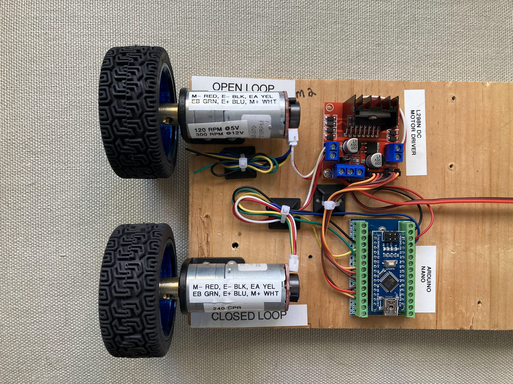

class: center, middle

# High-Speed Optical Encoder Counter 

**Compatible with the Qwiic/STEMMA ecosystem from SparkFun and Adafruit**

Rebecca Snyder, Steve Traugott

*CSWG Workshop March 2025*

---

# Outline

- What is a quadrature optical encoder?
- Why are they needed?
- High speed issues
- Few open-source encoder counter boards right now
- What is i2c?
- What is Qwiic/STEMMA?
- Many available Qwiic/STEMMA microcontroller boards
- Many available Qwiic/STEMMA peripherals
- No available Qwiic/STEMMA high-speed encoder counters

---

# What is a quadrature optical encoder?

- Sensor for tracking rotational position and direction
- Uses two output channels (A and B) offset by 90 degrees
- Optical disk with alternating opaque/transparent sections
- LED light source and photodetector generate signals

- [Incremental encoder on Wikipedia](https://en.wikipedia.org/wiki/Incremental_encoder)
- [What is a Quadrature Encoder?](https://www.usdigital.com/blog/what-is-quadrature/)
- [Encoder Guide](https://www.phidgets.com/docs/Encoder_Guide)
- [Quadrature encoder signals](https://www.dynapar.com/technology/encoder_basics/quadrature_encoder/)

---
# How does an optical encoder work?

- Direction of rotation determined by phase relationship
- Counting pulses on both channels gives position and direction

- [Tutorial from AKM](https://www.akm.com/global/en/products/rotation-angle-sensor/tutorial/type-mechanism-2/)

---

# Where are optical encoders used?

## Low-speed applications
- User input for rotary controls

---
# Where are optical encoders used?

## High-speed applications
- Precise position, speed, and direction sensing for motors
    - motor + encoder = servo
    - closed-loop motor control

- [Real-Time Feedback Response](https://www.analog.com/en/lp/001/real-time-feedback-response.html)

---
# Closed-loop motor control

- [DC Motor Open Loop Vs Closed Loop Demonstrator](https://www.instructables.com/DC-Motor-Open-Loop-Vs-Closed-Loop-Demonstrator/)

---

# High speed issues

- Signal frequency increases with speed and resolution
- If using two GPIO pins to watch the A and B signals, microcontroller may miss pulses
    - Microcontroller still handling previous pulse when next pulse arrives
- Example: 
    - 2000 pulses/rev at 2,000 RPM * 2 detectors ≈ 133 kHz, or 7.5 µs per pulse
    - If microcontroller takes longer than 7.5 µs to process a pulse, it will miss the next one

- [High-speed quadrature encoder issue](https://forum.pjrc.com/index.php?threads%2Fhigh-speed-quadrature-encoder-issue-teensy-4-0.74408%2F)
- [Optical encoder skips pulses at high speeds](https://forum.arduino.cc/t/optical-encoder-skips-pulses-at-high-speeds/1275203)
---
# Solution:  Use dedicated hardware

- Encoder counter circuit with hardware quadrature decoding
- Counts pulses on A and B signals
- Figures out direction of rotation from phase relationship
- Uses pulse count and direction to maintain a position counter
- Microcontroller reads position counter by some method -- I2C, SPI, serial, etc.

[Quadrature decoder](https://en.wikipedia.org/wiki/Incremental_encoder#Quadrature_decoder)
---
# The missing piece

- Open-source encoder counter boards are rare
    - This causes the Maker and open hardware community to use
      open-loop control for motors
    - e.g. most 3D printers are open-loop
- Even bigger gap for boards compatible with Qwiic/STEMMA ecosystem
  from SparkFun and Adafruit
    - Qwiic/STEMMA is a standardized connector for I2C devices
- No Qwiic/STEMMA encoder counter boards known to exist as of this
  writing
    - This makes closed-loop prototyping harder than it should be

[Layer shifts](https://wiki.bambulab.com/en/knowledge-sharing/layer-shifts)

---

# What is I2C?

- Inter-Integrated Circuit communication protocol
- Two-wire interface: SDA (data) and SCL (clock)
- Allows multiple devices on the same bus
- Simple and widely supported
    - many microcontrollers have I2C hardware
    - your laptop uses I2C internally to talk to the trackpad, keyboard, etc.

- [I2C protocol](https://en.wikipedia.org/wiki/I%C2%B2C)

---

# What is Qwiic/STEMMA?

- Connectors for I2C devices standardized by SparkFun and Adafruit
- Qwiic (SparkFun) and STEMMA QT (Adafruit) are compatible with each
  other
- 4-pin JST SH connector (3.3V, GND, SDA, SCL)
- Speeds up prototyping by eliminating soldering and wiring

- [SparkFun Qwiic](https://www.sparkfun.com/qwiic)
- [Adafruit STEMMA QT](https://learn.adafruit.com/introducing-adafruit-stemma-qt/what-is-stemma-qt)

---

# Many available Qwiic/STEMMA microcontroller boards

- Arduino-compatible boards
- Adafruit Feather and QT Py series
- Teensy with STEMMA QT adapter
- Raspberry Pi with STEMMA QT hat
- Easy integration with existing projects

- [Qwiic/STEMMA microcontroller boards](https://www.digikey.com/en/products/filter/evaluation-boards/embedded-mcu-dsp-evaluation-boards/qwiic-stemma-qt/786?s=N4IgjCBcpg7ALAJiqAxlAZgQwDYGcBTAGhADcA7KAFwCcBXYkAeygG0QkA2TgBgGYQAXRIAHKlBABlWgEtyAcxABfFUA)
- [Adafruit QT boards](https://www.adafruit.com/stemma)
- [SparkFun Qwiic boards](https://www.sparkfun.com/qwiic)

---

# Many available Qwiic/STEMMA peripherals

- Sensors: accelerometers, light sensors, RTCs
- Displays: OLED screens
- Actuators and input devices
- Rapid prototyping with plug-and-play modules

---

# No available Qwiic/STEMMA high-speed encoder counters

- Current gap in the Qwiic/STEMMA ecosystem
- Opportunity for development of a dedicated encoder counter
- Would simplify integration of high-speed encoders in projects
- Potential to address limitations of software-based counting

---

[^1]: https://www.usdigital.com/blog/what-is-quadrature/

[^2]: https://www.phidgets.com/docs/Encoder_Guide

[^3]: https://www.automate.org/motion-control/industry-insights/understanding-optical-encoders-part-i-of-ii

[^4]: https://github.com/luni64/EncoderTool

[^5]: https://github.com/Fattoresaimon/i2cencoder

[^6]: https://learn.adafruit.com/introducing-adafruit-stemma-qt/sparkfun-qwiic

[^7]: https://bc-robotics.com/product-tag/stemma-qt/

[^8]: https://core-electronics.com.au/adafruit-i2c-stemma-qt-rotary-encoder-breakout-with-encoder-stemma-qt-qwiic.html

[^9]: https://www.fiveflute.com/guide/understanding-quadrature-encoders-a-comprehensive-guide-for-mechanical-engineers/

[^10]: https://forum.pjrc.com/index.php?threads%2Fhigh-speed-quadrature-encoder-issue-teensy-4-0.74408%2F

[^11]: https://ww1.microchip.com/downloads/en/DeviceDoc/70208A.pdf

[^12]: https://dev.ti.com/tirex/explore/node?node=A__AYuKeLONYZ4NJtiy3OplhQ__C28X-ACADEMY__1sbHxUB__LATEST

[^13]: https://www.youtube.com/watch?v=o1Oev-B7ScM

[^14]: https://www.deltamotion.com/support/webhelp/rmctools/Content/Controller_Features/Transducer_Basics/Quadrature_Fundamentals.htm

[^15]: https://forums.ni.com/t5/Counter-Timer/Quadrature-encoder-counting-erratically/td-p/1180271

[^16]: https://electronics.stackexchange.com/questions/339919/quadrature-encoder-interface-loses-count

[^17]: https://forum.unitronics.com/topic/1884-shaft-encoder-x2-counting-issues/

[^18]: https://www.dynapar.com/knowledge/encoder_issues/encoder_signal/

[^19]: https://forum.arduino.cc/t/advice-on-rotary-encoders-at-high-speed/672756

[^20]: https://www.practicalmachinist.com/forum/threads/encoder-failure-at-high-speed.237608/

[^21]: https://forum.arduino.cc/t/optical-encoder-skips-pulses-at-high-speeds/1275203

[^22]: https://www.playingwithfusion.com/productview.php?pdid=193

[^23]: https://accesio.com/product/m-2-quad-8/

[^24]: https://www.reddit.com/r/MechanicalKeyboards/comments/r5i9mf/ladispad_an_opensource_11_key_macropad_with_2/

[^25]: https://dl.acm.org/doi/10.1145/3664647.3685525

[^26]: https://soldered.com/product/rotary-encoder-board-with-easyc/

[^27]: https://www.hackster.io/news/roendi-is-an-open-source-rotary-encoder-featuring-a-1-28-tft-display-d626c69541f5

[^28]: https://www.usdigital.com/products/accessories/interfaces/

[^29]: https://stackoverflow.com/questions/6181914/open-source-video-encoders-for-an-embedded-system

[^30]: https://www.robot-electronics.co.uk/i2c-tutorial

[^31]: https://www.reddit.com/r/explainlikeimfive/comments/4lpoiz/eli5what_is_i²c_protocol_is_and_how_it_works/

[^32]: https://learn.sparkfun.com/tutorials/i2c/all

[^33]: https://www.youtube.com/watch?v=CAvawEcxoPU

[^34]: https://www.seeedstudio.com/blog/2022/09/02/i2c-communication-protocol-and-how-it-works/

[^35]: https://shop.pimoroni.com/en-us/products/adafruit-qwiic-stemma-qt-breakout-board

[^36]: https://bc-robotics.com/product-category/cables-wiring/qwiic-stemma-qt/

[^37]: https://www.sparkfun.com/qwiic

[^38]: https://forum.pi-top.com/t/grove-stemma-stemma-qt-qwiic-gravity/669

[^39]: https://www.digikey.be/en/products/filter/evaluation-boards/embedded-mcu-dsp-evaluation-boards/qwiic-stemma-qt/786?s=N4IgjCBcpg7ALAJiqAxlAZgQwDYGcBTAGhADcA7KAFwCcBXYkAeygG0QkA2TgBgGYQAXRIAHKlBABlWgEtyAcxABfFUA

[^40]: https://www.digikey.com/en/products/filter/evaluation-boards/embedded-mcu-dsp-evaluation-boards/qwiic-stemma-qt/786?s=N4IgjCBcpg7ALAJiqAxlAZgQwDYGcBTAGhADcA7KAFwCcBXYkAeygG0QkA2TgBgGYQAXRIAHKlBABlWgEtyAcxABfFUA

[^41]: https://learn.adafruit.com/category/stemma

[^42]: https://www.jameco.com/z/5651-Adafruit-Industries-Scoutmakes-FM-Radio-Board-Stemma-QT-Qwiic_2526039.html

[^43]: https://adafruit.usedgoodies.com/hardware/choosing_a_board/

[^44]: https://bc-robotics.com/shop/qwiic-stemma-qt-port-expander/

[^45]: https://store.rakwireless.com/products/rak13009-wisblock-qwiic-interface

[^46]: https://learn.adafruit.com/introducing-adafruit-stemma-qt/what-is-stemma-qt

[^47]: https://www.seeedstudio.com/Grove-Qwiic-Hub-p-4531.html

[^48]: https://www.digikey.com/en/maker/projects/adafruit-stemma-stemma-qt/489773d34d0344cb8f39574002b66d91

[^49]: https://learn.adafruit.com/introducing-adafruit-stemma-qt?view=all

[^50]: https://coolcomponents.co.uk/collections/new-stemma-qt-qwiic

[^51]: https://www.mouser.com/c/tools-supplies/accessories/adafruit-accessories/?q=qwiic+cable

[^52]: https://forum.arduino.cc/t/get-the-rotation-of-an-object-on-a-turntable/551473?page=2

[^53]: https://forum.core-electronics.com.au/t/adafruit-i2c-qt-rotary-encoder-with-neopixel-stemma-qt-qwiic/15535

[^54]: https://www.youtube.com/watch?v=Y1TeJnu4XSA

[^55]: https://en.wikipedia.org/wiki/Incremental_encoder

[^56]: https://eltra-encoder.eu/news/quadrature-encoder

[^57]: https://cdn.sparkfun.com/datasheets/Robotics/How to use a quadrature encoder.pdf

[^58]: https://www.youtube.com/watch?v=NfX0uOaXQ3c

[^59]: https://forum.arduino.cc/t/reading-a-high-speed-encoder-while-performing-other-tasks/284173

[^60]: https://www.hessmer.org/blog/2011/01/30/quadrature-encoder-too-fast-for-arduino-with-solution/

[^61]: https://www.dynapar.com/technology/encoder_basics/quadrature_encoder/

[^62]: https://electronics.stackexchange.com/questions/523723/optical-quadrature-encoder-goes-out-of-sync-at-higher-speeds

[^63]: https://www.plctalk.net/threads/unusual-encoder-failure-modes.98592/

[^64]: http://engineering.nyu.edu/mechatronics/Control_Lab/Criag/Craig_RPI/SenActinMecha/S&A_Optical_Encoders.pdf

[^65]: https://forum.arduino.cc/t/is-there-a-simple-quadrature-decoder-module/481402

[^66]: https://github.com/madhephaestus/ESP32Encoder

[^67]: https://westsideelectronics.com/using-the-3-cent-microcontroller/

[^68]: https://accesio.com/product/104-quad-8/

[^69]: https://products.y2kb.com/en/encoder-counter/v1/

[^70]: https://netflixtechblog.com/svt-av1-an-open-source-av1-encoder-and-decoder-ad295d9b5ca2

[^71]: https://www.circuitbasics.com/basics-of-the-i2c-communication-protocol/

[^72]: https://www.analog.com/en/resources/technical-articles/i2c-primer-what-is-i2c-part-1.html

[^73]: https://www.prodigytechno.com/i2c-protocol

[^74]: https://www.ti.com/lit/pdf/sbaa565

[^75]: https://www.analog.com/en/resources/analog-dialogue/articles/i2c-communication-protocol-understanding-i2c-primer-pmbus-and-smbus.html

[^76]: https://docs.arduino.cc/learn/communication/wire

[^77]: https://en.wikipedia.org/wiki/I²C

[^78]: https://www.tomshardware.com/features/stemma-vs-qwiic-vs-grove-connectors

[^79]: https://github.com/adafruit/awesome-stemma

[^80]: https://www.sparkfun.com/flexible-qwiic-to-stemma-cable-500mm.html

[^81]: https://www.seeedstudio.com/Grove-Qwiic-STEMMA-QT-Interface-to-Male-Female-Jumper-Cables-p-4467.html

[^82]: https://www.adafruit.com/product/5625

[^83]: https://www.electromaker.io/blog/article/adafruit-stemma-and-stemma-qt-sensors-2022-buyers-guide

[^84]: https://www.adafruit.com/product/5961

[^85]: https://www.adafruit.com/stemma

[^86]: https://shop.pimoroni.com/en-us/products/adafruit-qt-5v-to-3v-shifter-breakout-stemma-qt-qwiic

[^87]: https://core-electronics.com.au/adafruit-qwiic-stemma-qt-breakout-board.html

[^88]: https://botland.store/expanders-extension-modules/22197-stemma-qt-qwiic-hub-5-port-adafruit-5625.html

[^89]: https://shop.pimoroni.com/en-us/products/adafruit-qwiic-stemma-qt-5-port-hub

[^90]: https://coolcomponents.co.uk/products/qwiic-twist-rgb-rotary-encoder-breakout

[^91]: https://botland.store/encoders/19787-neopixel-rotary-encoder-i2c-stemma-qt-qwiic-adafruit-4991-5903351245418.html

[^92]: https://www.adafruit.com/product/4991

[^93]: https://botland.store/encoders/23548-quad-rotary-encoder-breakout-encoder-expansion-module-neopixel-i2c-stemma-qt-qwiic-adafruit-5752.html

[^94]: https://www.plctalk.net/threads/how-to-use-encoders-high-speed-counters.35270/

[^95]: https://forums.adafruit.com/viewtopic.php?t=206678
